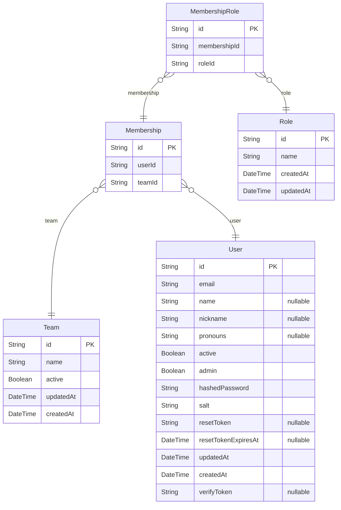

```mermaid
erDiagram

  User {
    String id PK 
    String email  
    String name  "nullable"
    String nickname  "nullable"
    String pronouns  "nullable"
    Boolean active  
    Boolean admin  
    String hashedPassword  
    String salt  
    String resetToken  "nullable"
    DateTime resetTokenExpiresAt  "nullable"
    DateTime updatedAt  
    DateTime createdAt  
    String verifyToken  "nullable"
    }
  

  Membership {
    String id PK 
    String userId  
    String teamId  
    }
  

  Team {
    String id PK 
    String name  
    Boolean active  
    DateTime updatedAt  
    DateTime createdAt  
    }
  

  MembershipRole {
    String id PK 
    String membershipId  
    String roleId  
    }
  

  Role {
    String id PK 
    String name  
    DateTime createdAt  
    DateTime updatedAt  
    }
  
    Membership o{--|| Team : "team"
    Membership o{--|| User : "user"
    MembershipRole o{--|| Membership : "membership"
    MembershipRole o{--|| Role : "role"
```
